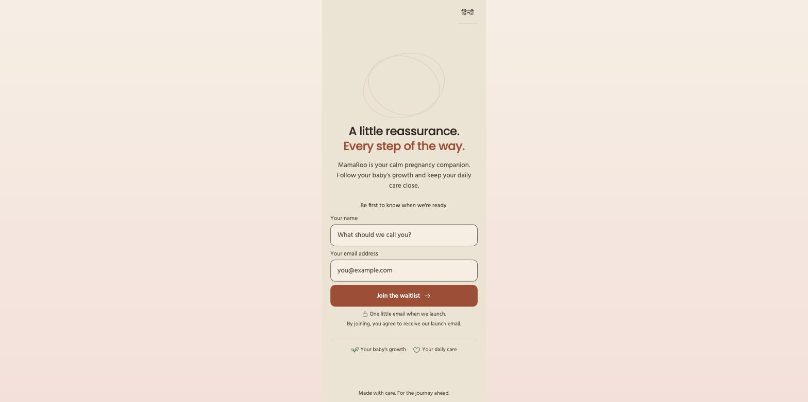

# MamaRoo

**[www.mamaroo.co.in](https://www.mamaroo.co.in)**

MamaRoo is a mobile web app — open it in your phone's browser, no install needed — for pregnant women in India.

## The problem

Middle-income pregnant women in India get real guidance only during brief, infrequent doctor
visits. Between visits they have daily questions and no structured place for answers or records.

MamaRoo gives her a calm daily companion, a structured record of her own care, and a one-tap
summary she can hand to her doctor.

## What it does

- **Today** — a daily check-in, with a feeling/symptom box that routes urgent concerns to a
  triage flow.
- **My Baby** — week-by-week baby development info.
- **My Care** — vitals (blood pressure, weight) with trend charts, medicine and symptom logging.
- **Guide** — a reviewed content library and a retrieval-only chatbot: it only surfaces existing,
  reviewed passages verbatim, and never generates its own medical text.
- **Doctor Visit Summary** — a one-tap summary of her records, ready to print or export as a PDF
  for her next appointment.
- **Bilingual** — full English and Hindi support.

## Status

Pre-launch. The product is in active development; the live site currently collects waitlist
signups ahead of launch.

## Built with

Next.js (App Router) + TypeScript + Tailwind CSS, Supabase (Postgres, Auth, Storage), deployed on
Vercel.
