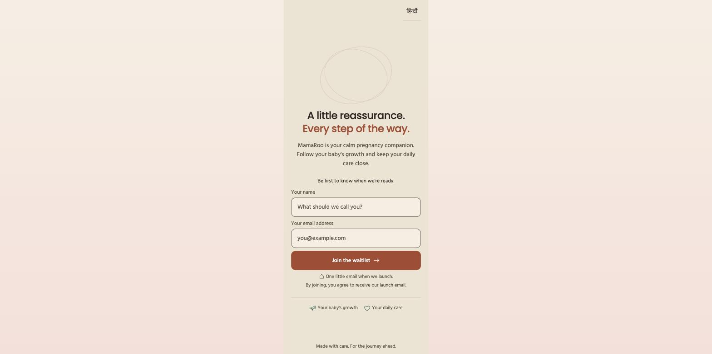

# MamaRoo

**A daily companion for pregnant women in India: check-ins, care records and a doctor-visit summary, in English and Hindi.**

[Live site →](https://www.mamaroo.co.in/)

## The problem

Middle-income pregnant women in India get real guidance only during brief, infrequent doctor visits. Between visits they have daily questions and no structured place for answers or records. The usual fallback is search results, forums and family advice, none of it reviewed and none of it written down in a form a doctor can use.

## What it does

- **Today:** a daily check-in. A "how are you feeling" box (voice or text) routes concerning symptoms to a three-tier triage flow: general, contact your clinic, or urgent.
- **My Baby:** week-by-week development of the baby.
- **My Care:** blood pressure and weight with trend charts, plus medicine and symptom logs and report uploads.
- **Guide:** a reviewed reading library and a chatbot that only ever shows reviewed passages, word for word.
- **Doctor Visit Summary:** one tap turns her records into a summary to print or export as a PDF for her next appointment.
- **Bilingual:** the full interface in English and Hindi.

## Key product decisions

- **The chatbot never writes health advice.** Search finds candidate passages from a reviewed library, and the model only *picks* one. The answer shown is the stored passage, byte for byte. If nothing fits, she is handed to triage. Generated answers were rejected until there is a real way to verify them and a medical reviewer.
- **Legal rules are enforced by tests, not prompts.** Indian law (PCPNDT Act) forbids anything that could reveal the baby's sex. There is no gender field anywhere, questions about it are refused before any model call, and an automated scan checks the whole codebase.
- **Analytics can't carry health data by design.** The analytics vendor has no India region, so every event has a fixed list of allowed fields and values, and free text can't be sent at all. A list of banned fields was rejected because `{ condition: "bleeding" }` would pass it.
- **Nothing reviewed is machine-translated.** A Hindi question with only English material gets the English passage, marked "English only", because a machine translation of reviewed text is no longer reviewed text.
- **A web app, not an app-store download.** It opens in the phone browser with nothing to install, and is packaged for Google Play from the same code.

## Results & evidence

<!-- TODO(Rochak): confirm the number and wording below before publishing. Your profile README says "15 early users"; the previous version of this README said the site only collects waitlist signups. -->
- Pre-launch, with 15 early users.
- Built test-first. Every guarantee above (verbatim answers, sex-determination refusal, analytics allowlist) is an automated test.

## Scope & limits

- **Pregnancy only.** No postpartum or newborn features, no doctor portal, no payments.
- **Not medical advice.** Every health statement carries a disclaimer, and the doctor summary states that the data was entered by her and is not medically verified.
- **Launch gates still open:** clinical review of the reading library, and legal review of the privacy policy and terms (both are drafts).
- **Reminders are in-app only.** Push notifications are not built yet.
- **The reading library is English-first.** Hindi content is planned.

## Next in roadmap

- Push notifications for reminders, and phone-number sign-in.
- A Hindi reading library.
- Reading values out of uploaded reports, with her confirmation required before anything is treated as fact.
- A postpartum and newborn mode, scoped as its own product.

<strong>Tech stack</strong>

Next.js (App Router), TypeScript, Tailwind CSS, Supabase (Postgres, Auth, Storage, Row Level Security, hosted in Mumbai), Google Gemini behind a provider interface, PostHog (opt-in, allowlisted events only), deployed on Vercel.

